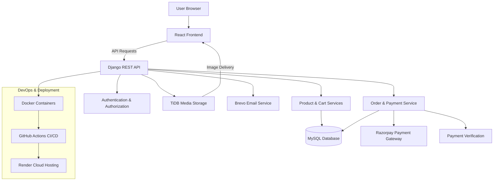
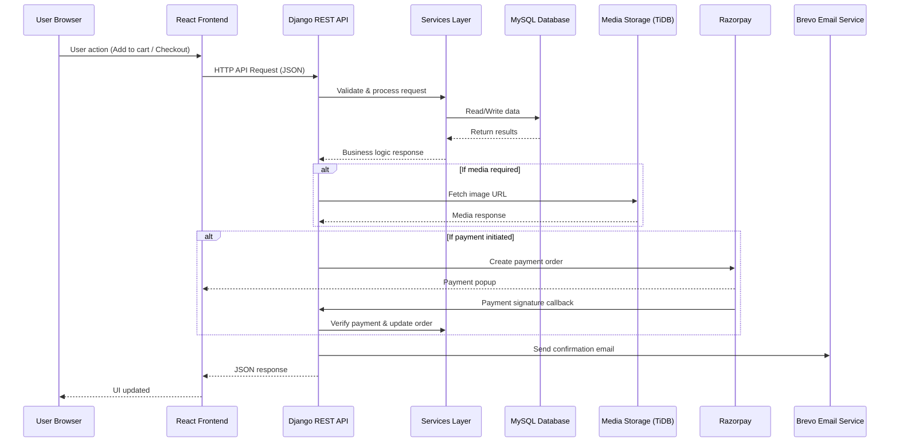

# 🛒 UrbanCart

UrbanCart is a full-stack eCommerce web application that allows users to browse products, manage a shopping cart, and place secure orders.  
It demonstrates real-world shopping workflows including authentication, cart management, order processing, email notification, and payment verification.

---

## 🚀 Features

- Secure user authentication and authorization

- Product browsing and search functionality

- Cart and order management system

- Admin panel for product and order control

- Cloud-based media storage with CDN-style delivery for product images

- Secure checkout with Razorpay payment gateway integration and signature verification

- Containerized deployment using Docker for environment consistency

- Automated CI/CD pipeline using GitHub Actions

- Production deployment on Render

- Fully responsive user interface

---

## 🛠 Tech Stack

### Frontend
- React.js
- JavaScript (ES6+)
- Material UI
- HTML5 & CSS3

### Backend
- Python
- Django
- Django REST Framework (REST APIs)

### Database & Storage
- MySQL (primary relational database)
- TiDB (cloud storage layer for media assets)

### Payments & Communication
- Razorpay (payment processing & verification)
- Brevo (transactional email delivery)

### DevOps & Deployment
- Docker (containerization)
- GitHub Actions (CI/CD automation)
- Render (cloud deployment)

---

## 🏗 Project Architecture 

 
 

## ⚡ Request Lifecycle

### 🖹 API documentation
 - documentation in progress...
    
